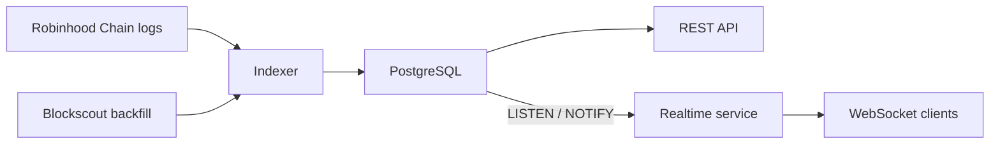

# Events and Indexing

Factory events are the canonical launch feed. Pool and token logs provide market and holder data.

## TokenCreated

```solidity
event TokenCreated(
    address indexed token,
    address indexed creator,
    address indexed pool,
    uint256 positionTokenId,
    string name,
    string symbol,
    string metadataURI,
    uint256 initialBuyAmount
);
```

Use this event to identify official launches and obtain the token, creator, pool, position ID and metadata URI.

## PositionRegistered

```solidity
event PositionRegistered(
    uint256 indexed tokenId,
    address indexed token,
    address indexed creator,
    address platform,
    uint16 creatorFeeBips
);
```

## FeesClaimed

```solidity
event FeesClaimed(
    uint256 indexed tokenId,
    address indexed creator,
    uint256 amount0Creator,
    uint256 amount1Creator,
    uint256 amount0Platform,
    uint256 amount1Platform
);
```

## Data sources

| Dataset | Source |
| --- | --- |
| Launches | Factory `TokenCreated` logs |
| Metadata | Token `metadataURI` and public IPFS |
| Trades | Uniswap V3 pool `Swap` logs |
| Holders | ERC-20 `Transfer` logs |
| Fee claims | Locker `FeesClaimed` logs |
| Graduation | Confirmed indexed pool WETH balance |

## Hatchr pipeline



The worker indexes two blocks behind the observed chain tip by default. This confirmation buffer introduces a small delay but reduces exposure to short reorganizations.

## Integration rule

Treat Hatchr APIs as convenience layers. For consensus-sensitive logic, independently verify logs and contract state through a Robinhood Chain RPC.

