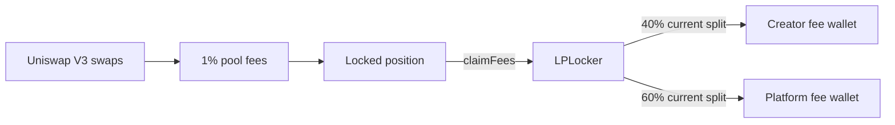

# Creator Fees

Hatchr pools use the Uniswap V3 **1% fee tier**. This is a pool-level swap fee, not a tax implemented by the token.

## Current split

When the position is registered, the locker stores:

- creator fee wallet;
- Hatchr platform fee wallet; and
- creator fee percentage.

The current split is:

| Recipient | Share of collected LP fees |
| --- | ---: |
| Creator | 40% |
| Hatchr | 60% |

## Fee flow

The creator does not receive 1% of each trade directly. Fees first accrue to the LP position and are divided when collected.

## Assets received

Claims may contain the launched token, WETH or both. The exact assets depend on token ordering and trading activity.

## Permissionless claim call

Anyone can trigger `claimFees(positionTokenId)`. The caller cannot choose the recipients. The locker sends proceeds only to the recipients stored for that position.


The creator percentage is owner-configurable for future position registrations. Read the factory and registered locker position rather than assuming the split.


