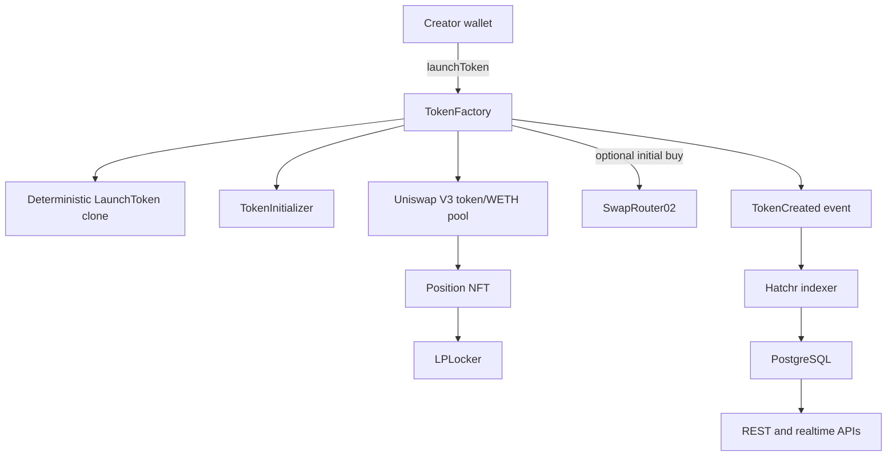

# Launch Architecture

Hatchr uses one factory transaction to create a fixed-supply token and a live Uniswap V3 market.



## Launch call

The public factory entry point accepts:

```solidity
launchToken(
    string name,
    string symbol,
    string metadataURI,
    address feeWallet,
    address initialBuyRecipient,
    bytes32 salt
)
```

The call is payable. `msg.value` contains the configured launch fee plus any optional initial-buy ETH.

## Execution order

1. Validate metadata and wallet addresses.
2. Transfer the configured launch fee.
3. Deploy a deterministic minimal clone.
4. Initialize token metadata and supply through the trusted initializer.
5. Create and initialize the Uniswap V3 pool.
6. Mint a single-sided concentrated-liquidity position.
7. Transfer the position NFT to the locker.
8. Register creator and platform fee recipients.
9. Lock any token rounding dust.
10. Execute the optional WETH-to-token initial buy.
11. Emit `TokenCreated`.

The factory uses `nonReentrant`, and all steps share one transaction. A revert rolls back the complete launch.

## No pre-market

There is no separate Hatchr exchange or pre-graduation bonding curve. The Uniswap V3 pool is the market from launch.

