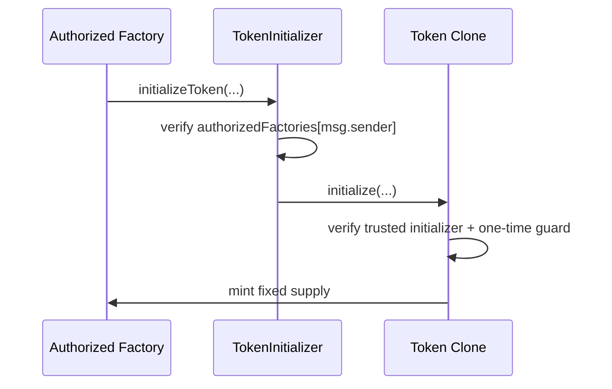

# Token Contract

Every Hatchr token is a deterministic minimal clone of the published `LaunchToken` implementation.

## Fixed properties

- ERC-20 with 18 decimals.
- Exactly 1 billion tokens per launch.
- Supply minted once during initialization.
- No external mint function after initialization.
- No token owner or token-admin role.
- No upgrade function.
- No transfer tax.
- No blacklist or whitelist.
- No pause switch.
- No maximum-wallet rule.
- Metadata URI has no setter.

## Initialization protection

The implementation disables its own initializer in its constructor. A clone can be initialized once and only by the immutable trusted `TokenInitializer`. That initializer accepts calls only from authorized factories.

This prevents arbitrary wallets from initializing a clone or selecting a mint recipient.

## Minimal clone model

The clone delegates token logic to a fixed implementation address embedded in its minimal bytecode. It is not a beacon proxy and has no admin-controlled implementation slot.

Changing the factory's implementation for future launches does not rewrite existing token clones.

